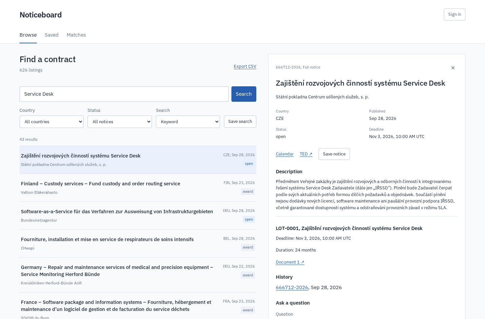

# Noticeboard

[](pyproject.toml)
[](noticeboard/)
[](compose.yaml)
[](procurement/search.py)
[](frontend/)
[](LICENSE)

Noticeboard makes it easier to find interesting public contracts and keep track of them, with multilingual search, amendment comparisons and source-cited assistance in one application. It's free to run yourself, and you can use the same collection from the browser, the API or your own MCP client.

Noticeboard reads procurement notices from [TED](https://ted.europa.eu/). It keeps the source records, groups publications by procedure, and preserves lot deadlines and amendment history. Search works across a local collection.

[Try the browser demo](https://robinwydaeghe.com/noticeboard/) · [API and deployment guide](docs/operations.md)

The demo uses a dated public snapshot and saves your work in this browser. The full installation adds scheduled imports, hybrid retrieval, accounts and model assistance.



## Run it

You need Docker Compose and Python 3.12 or newer. The default ports bind to localhost.

```sh
python3 scripts/configure.py
docker compose --profile app up --build -d
docker compose exec app python manage.py bootstrap
docker compose exec app cat runtime/private/LOCAL_ACCESS.txt
```

Open http://localhost:8920. Import a bounded collection, then build its search index:

```sh
docker compose exec app python manage.py sync_ted \
  'FT ~ "software" AND publication-date >= 20260901 SORT BY publication-date DESC' --limit 300
docker compose exec app python manage.py index_notices --vectors
```

The first vector build downloads a multilingual CPU embedding model. A keyword-only build uses `index_notices` without `--vectors`. [Local development and XML enrichment](docs/operations.md) are also supported.

## Use it

- Search by text, country and notice status. Hybrid search combines keyword and multilingual vector rankings.
- Open a notice to read its lots, source links and available publication history. Compare amendments at lot level.
- Save notices, review notes and searches. Changed versions stay marked until you review them.
- Export search results, review records and exact deadlines for your calendar.
- Describe your work to get a reading list of possible matches. Follow related notices to find comparable contracts.
- Ask for source passages. An optional local or remote language model can produce a draft answer with checked quotes.

The watchlist is for everyone who has ever said 'I'll remember which tab that was' and then opened another twelve.

The application is free and self-hosted. Accounts and saved work belong to your installation. No commercial API key is required.

## Tech stack

Django and PostgreSQL hold the records. OpenSearch provides BM25 and vector retrieval, with reciprocal-rank fusion. A React/TypeScript interface uses the same documented API as the read-only MCP server. An Airflow workflow imports an overlapping date window and rebuilds the derived index.

Imports preserve source checksums and report partial failures. Index rebuilds publish through an atomic alias switch. Session-authenticated writes enforce CSRF protection and account ownership. Model quotes must occur in the supplied evidence, which includes labelled structured source fields. Numeric tokens in each draft claim must also appear in its quoted passage.

[Architecture](docs/architecture.md) · [Operations](docs/operations.md) · [Evaluation](docs/evaluation.md) · [Source and licence notes](THIRD_PARTY_NOTICES.md)
