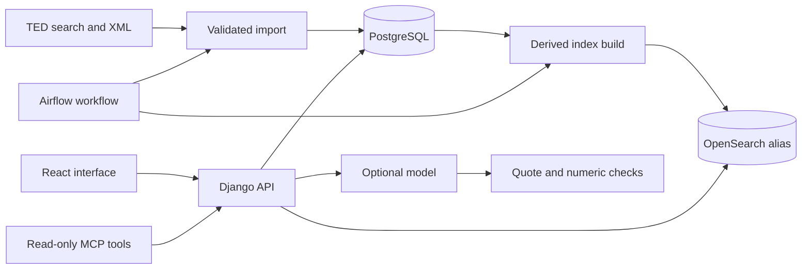

# Architecture

Noticeboard is one Django application with separate modules for parsing, ingestion, retrieval, serialization and assistance. The database is authoritative, and the search index can be rebuilt.

## Source records and versions

An `Opportunity` represents a source procedure. Its `Notice` records are ordered by publication date and publication number, regardless of arrival order. Each source payload has a SHA-256 checksum and an `Artifact` copy. XML enrichment can replace incomplete search metadata, but metadata cannot overwrite authoritative XML.

Lots retain their own identifiers, deadlines, amounts, document links and available requirements. Search API arrays are preserved as metadata instead of being zipped into invented lot associations. Deadlines require an explicit time zone. Awards, planning notices and competitions remain distinct.

An `ImportRun` records the query, cursor, counts, errors and completion status. A bounded run reached its configured limit, and a partial run encountered record failures. Neither means the full source has been imported. TED occassionally challenges direct XML downloads, so enrichment uses an ordinary browser session.

## Retrieval

OpenSearch indexes the current publication of each procedure. Keyword retrieval uses BM25. Hybrid retrieval fuses the top keyword and multilingual embedding results using `1 / (60 + rank)`. Exact time-dependent status filtering happens after candidate retrieval. API responses expose the candidate limit and any fallback warning.

A rebuild writes a new index, refreshes it, and switches the read alias only after all batches succeed. A failed build leaves the previous index in place. A local file lock serializes rebuilds. A deployment across several machines should use one indexer. Imports and builds are separate, so new records can be absent from search until the next successful rebuild.

If OpenSearch is unavailable, the API returns database text matches with a warning. That fallback does not provide semantic retrieval. The embedding model runs on CPU and is optional for a keyword-only installation.

## Saved work and assistance

Watchlists, notes, saved searches and matching profiles are scoped to an authenticated user. A watch records the last reviewed notice. The change inbox compares that version with the procedure's current publication. Calendar exports contain only explicit lot deadlines.

Assistance defaults to excerpts. Model requests are opt-in, use only the selected notice, and treat source text as untrusted evidence. Returned quotes must occur in the supplied text after whitespace normalization, and digit-based numeric claims must appear in the quote. These checks establish limited provenance. They do not verify entailment, translated numbers, eligibility or the completeness of external documents.

The MCP server exposes four public read operations over HTTP. It has no account credentials, write tools, shell tools or outbound notification delivery.
